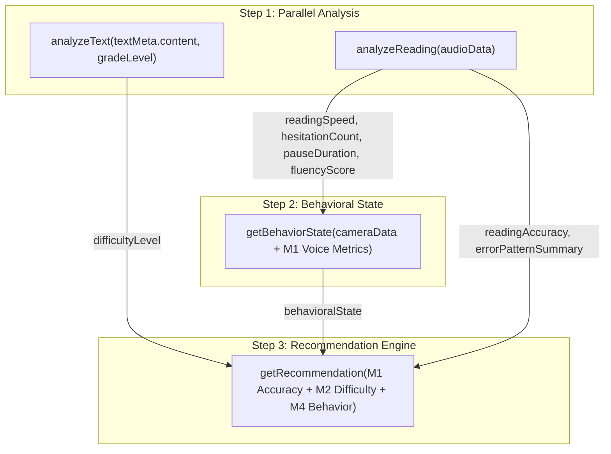

# Nena-Man Central API Client Layer

This directory contains the central API client layer, environment configuration, mock response engines, and multi-module session pipeline orchestrator for all four AI modules of the **Nena-Man** application.

---

## Architecture Overview

```
frontend/
├── config/
│   ├── env.ts                   # Runtime-validated Expo environment variables
│   └── flags.ts                 # Independent per-module mock/real toggles
└── api/
    ├── types.ts                 # Finalized TypeScript contracts for all 4 AI modules
    ├── client.ts                # Central Axios instance with auth & error interceptors
    ├── endpoints.ts             # Direct module endpoints routing to Mock or Real API
    ├── sessionPipeline.ts       # Dependent 3-step sequencing orchestrator & store sync
    ├── mocks/                   # Realistic mock response generators (~800ms delay)
    │   ├── readingAnalysisMock.ts
    │   ├── textDifficultyMock.ts
    │   ├── behaviorStateMock.ts
    │   └── recommendationMock.ts
    └── README.md                # This documentation
```

---

## 1. Where Contracts & Types Live

All finalized JSON contracts are strictly defined in [`api/types.ts`](./types.ts):

| Module | Owner | Interface | Description |
|---|---|---|---|
| **M1: Reading Error Analysis** | Kulathilaka (IT23175198) | `ReadingAnalysisResult` | Sinhala word status, severity, accuracy, speed, pause duration |
| **M2: Text Difficulty** | Edirisooriya (IT23179844) | `TextDifficultyResult` | Grade difficulty level, split/simplification need, support level |
| **M4: Behavioral State** | Pushpakumara (IT23177246) | `BehaviorStateInput`, `BehaviorStateResult` | Multimodal camera + interaction + M1 voice telemetry, engagement state |
| **M3: Recommendation Engine** | Ranaweera (IT23199712) | `RecommendationInput`, `RecommendationResult` | Adaptive difficulty transition, ranked top-K activities, rationale |

> **Rule:** Never invent or alter field names in `api/types.ts`. Any changes must be coordinated across the respective research component teams.

---

## 2. Environment Configuration & Mock Toggles

Configuration is managed via Expo's `EXPO_PUBLIC_` environment variables in `.env` (see `.env.example`).

### Runtime Validation (`config/env.ts`)
```typescript
import { ENV } from '@/config/env';

console.log(ENV.API_BASE_URL); // Guaranteed non-empty; throws on launch if missing
```

### Independent Per-Module Mock Toggles (`config/flags.ts`)
Each module can be toggled between Mock mode and Real Backend mode independently via `.env`:

```bash
# In your .env file:
EXPO_PUBLIC_API_BASE_URL=https://your-dev-backend.example.com

# Set to "false" to switch a specific module to the live server
EXPO_PUBLIC_USE_MOCK_READING_ANALYSIS=true
EXPO_PUBLIC_USE_MOCK_TEXT_DIFFICULTY=true
EXPO_PUBLIC_USE_MOCK_BEHAVIOR_STATE=true
EXPO_PUBLIC_USE_MOCK_RECOMMENDATION=true
```

When set to `true` (default), calls to `endpoints.ts` execute local mock generators simulating real network latency (~800ms) with diverse clinical test cases.

---

## 3. Required Multi-Module Call Order (Section 7 Pipeline)

The four AI models are **not independent**. They have strict upstream/downstream data dependencies that must be executed in the following order:



### Sequencing Flow:
1. **Step 1 (Parallel)**:
   - `M2: analyzeText(textMeta.content, gradeLevel)`
   - `M1: analyzeReading(audioData)`
   - *Both start simultaneously.*
2. **Step 2 (Acoustic Dependency)**:
   - As soon as **M1** completes, `getBehaviorState()` is invoked.
   - It automatically extracts `{ readingSpeed, hesitationCount, pauseDuration, fluencyScore }` from M1 and merges them with Pushpakumara's camera/interaction telemetry.
   - **M4 does not need M2**, so it will proceed even if M2 fails!
3. **Step 3 (Multimodal Convergence)**:
   - As soon as **M1, M2, and M4** all complete, `getRecommendation()` is invoked.
   - It receives:
     - `readingAccuracy` & `errorPatternSummary` from **M1**
     - `difficultyLevel` from **M2**
     - `behavioralState` from **M4**
4. **Immediate State Sync**:
   - Each module's result is attached to `sessionStore.attachResult(module, data)` the millisecond it resolves; screens do not wait for the entire pipeline to finish before seeing partial updates.
5. **Partial Failure Tolerance**:
   - The pipeline returns a unified `PipelineResult` object containing succeeded results and isolated `errors[moduleName]` instead of throwing on the first error.

---

## 4. How to Call the Pipeline from a Screen

Screens should **never** import `axios` directly or invoke endpoint functions out of order manually. Use [`runReadingSessionPipeline`](./sessionPipeline.ts):

```tsx
import React, { useState } from 'react';
import { View, Text, Button, ActivityIndicator } from 'react-native';
import { runReadingSessionPipeline, PipelineResult } from '@/api/sessionPipeline';
import { useSession } from '@/store/hooks';

export function ReadingSessionSummaryScreen({ audioUri, passageText, gradeLevel }) {
  const [loading, setLoading] = useState(false);
  const [pipelineOutput, setPipelineOutput] = useState<PipelineResult | null>(null);

  // Zustand session store holds results updated reactively during pipeline execution
  const sessionResults = useSession((s) => s.results);

  const handleFinishReading = async () => {
    setLoading(true);

    // Run the full multi-module pipeline
    const result = await runReadingSessionPipeline(
      audioUri,
      { id: 'passage_01', content: passageText },
      gradeLevel,
      {
        // Pushpakumara camera & telemetry data:
        faceVisibility: true,
        eyeGaze: 'center',
        blinkRate: 18,
        responseTime: 1.4,
        idleTime: 0.5,
        taskCompletion: true,
      }
    );

    setPipelineOutput(result);
    setLoading(false);

    // Inspect individual step results
    if (result.success) {
      console.log('All 4 AI modules completed successfully!');
    } else {
      console.warn('Pipeline completed with partial failures:');
      if (result.errors.textDifficulty) {
        console.warn('Text difficulty failed:', result.errors.textDifficulty.message);
      }
      if (result.errors.recommendation) {
        console.warn('Recommendation skipped:', result.errors.recommendation.message);
      }
    }
  };

  return (
    <View>
      <Button title="Analyze Reading Session" onPress={handleFinishReading} />
      {loading && <ActivityIndicator />}
      {pipelineOutput?.readingAnalysis && (
        <Text>Accuracy: {(pipelineOutput.readingAnalysis.readingAccuracy * 100).toFixed(1)}%</Text>
      )}
      {pipelineOutput?.behaviorState && (
        <Text>State: {pipelineOutput.behaviorState.behavioralState}</Text>
      )}
    </View>
  );
}
```

---

## 5. Open Questions & Teammate Confirmations

The following fields in `api/types.ts` are marked with `// TODO` and require final specification from team members:

### For Pushpakumara (IT23177246) — Behavioral State Detection
- [ ] **`eyeGaze`**: Confirm allowed enum values (e.g. `'center' | 'left' | 'right' | 'looking_away'`). Currently kept as `string`.
- [ ] **`headPose`**: Confirm allowed enum values (e.g. `'forward' | 'tilted_left' | 'tilted_right' | 'downward'`). Currently kept as `string`.
- [ ] **`bodyPosture`**: Confirm allowed enum values (e.g. `'upright' | 'slumped' | 'leaning_forward'`). Currently kept as `string`.
- [ ] **`speakingPattern`**: Confirm whether this is distinct from `fluencyScore` or redundant with voice metrics from Module 1. Currently kept as `string`.
- [ ] **`interactionPattern`**: Confirm allowed enum values (e.g. `'focused' | 'erratic' | 'hesitant'`). Currently kept as `string`.
- [ ] **`taskCompletion`**: Confirm whether this should be a `boolean` (completed vs abandoned) or a `number` representing percentage completion (0.0 to 1.0). Currently kept as `boolean`.

### For Ranaweera (IT23199712) — Recommendation Engine
- [ ] **`activityHistory`**: Confirm the schema and shape expected by the model (e.g. string array of activity IDs `['act_01', 'act_02']` vs an array of activity objects with completion scores). Currently kept as `string[]`.
- [ ] **`difficultyHistory`**: Confirm the structure and length expected for previous difficulty transitions (e.g. `DifficultyTransition[]` like `['Maintain', 'Increase']`). Currently kept as `DifficultyTransition[]`.

---

## 6. Constraints & Coding Rules
- **No Direct Axios**: Do not import `axios` inside UI components or screens. All network calls must pass through `api/endpoints.ts` or `api/sessionPipeline.ts`.
- **Centralized Authentication**: The Axios instance in `api/client.ts` automatically attaches the user's Bearer token from `useAuthStoreBase.getState().token`. On `401 Unauthorized`, it automatically resets the session via `logout()`.
- **UI Error Separation**: API functions return normalized `ApiError` objects (`{ message, status, isNetworkError }`). Display formatting and user alerts must be handled by `feat/shared-states` (`ErrorView`).
